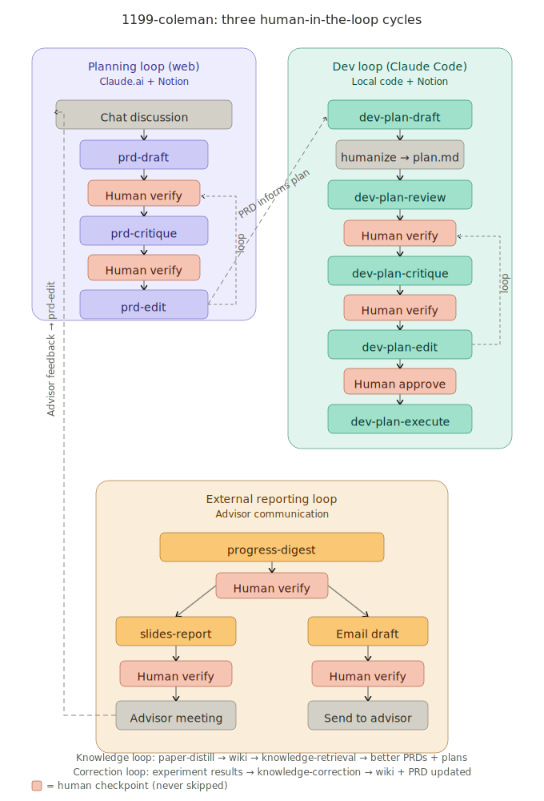

# 1199-coleman

Corporate bureaucrat for efficient research.

A personal skill library for Claude Code and Claude.ai that automates research project management — documentation, knowledge management, experiment design, progress tracking, and reporting — so you can spend your cognitive resources on thinking with your advisor instead of fighting execution details.

## Install

```bash
git clone https://github.com/YOUR_USERNAME/1199-coleman.git
cd 1199-coleman
bash install.sh
```

On pod restart, re-run `bash install.sh` (30 seconds).

## Architecture

All skills are flat — no subdirectory nesting. Composite skills only call atomic skills, never each other.



Three human-in-the-loop cycles, each with mandatory human checkpoints (coral boxes):

- **Planning loop** (purple, web-side): chat → prd-draft → human verify → prd-critique → human verify → prd-edit → loop back. PRD informs the dev plan via a cross-loop bridge.
- **Dev loop** (teal, Claude Code): PRD → dev-plan-draft → humanize → dev-plan-review → human verify → dev-plan-critique → human verify → dev-plan-edit → human approve → dev-plan-execute. An extra "approve" gate before any code execution.
- **External reporting** (amber): progress-digest → human verify → slides-report / email draft → human verify → advisor meeting / send. Advisor feedback flows back into the planning loop via prd-edit.

Two background loops sustain the system: the **knowledge loop** (paper-distill fills wiki → knowledge-retrieval gets smarter → PRDs improve) and the **correction loop** (experiment results → knowledge-correction → wiki and PRDs stay accurate).

```
Atomic Skills (IO operations)
  ↑
Composite Skills (orchestration + reasoning)
  ↑
Human (verify + decide)
```

**Core principle: the human never skips verify.**

## Skills

### Atomic (11) — Single-responsibility IO

| Skill | Read/Write | Target |
|-------|-----------|--------|
| `read-wiki` | read | Knowledge Base (Notion) |
| `read-all-prds` | read | Product team PRDs (Notion) |
| `read-tracker` | read | Progress Tracker DB (Notion) |
| `read-experiment-logs` | read | Dev team internal logs (Notion) |
| `read-comments` | read | Inline comments on any Notion page |
| `write-wiki-page` | write | Knowledge Base / PRDs / Logs (Notion) |
| `write-tracker` | write | Progress Tracker DB (Notion) |
| `write-comments` | write | Inline comments on any Notion page |
| `append-version-log` | write | PRD Version Log section (Notion) |
| `clone-codebase` | read | Git repo → `/tmp/` |

### Composite (16) — Orchestration workflows

| Skill | Trigger phrases | What it does |
|-------|----------------|-------------|
| `knowledge-retrieval` | "how does X work", "what is Y" | Fast-path lookup: wiki + PRDs + local code |
| `progress-digest` | "current status", "generate email" | Cross-reference tracker + PRDs + logs → report or email |
| `paper-distill` | "distill this paper", "add to wiki" | Paper → six-section wiki entry + cross-ref propagation |
| `experiment-design` | "design an experiment", "test plan" | Step-by-step spec card (PLANNING or ENRICHED mode) |
| `prd-draft` | "write a PRD", "draft design doc" | Chat → first PRD with gap comments |
| `prd-critique` | "critique this PRD", "find problems" | AI finds problems → posts inline comments |
| `prd-edit` | "update the PRD", "incorporate feedback" | Resolve comments + edit + post new questions |
| `knowledge-correction` | "found a problem", "this is wrong" | Fix wiki facts / comment on PRD assumptions |
| `dev-plan-draft` | "draft dev plan", "create impl plan" | PRD → local draft.md → humanize → plan.md |
| `dev-plan-review` | "review this plan", "upload plan" | Local plan.md → Notion for human review |
| `dev-plan-critique` | "critique this plan", "check the plan" | AI reviews plan against code + PRD → posts comments |
| `dev-plan-edit` | "update the plan", "revise plan" | Resolve comments + edit plan + post new questions |
| `dev-plan-execute` | "execute the plan", "start the plan" | Notion → local plan.md → start humanize loop |
| `slides-report` | "generate slides", "prepare for meeting" | Progress data → MARP slide deck |
| `wiki-lint` | "lint the wiki", "check wiki health" | Find contradictions, broken refs, missing entries |

## Comment Tag Protocol

Skills communicate through Notion inline comments with standardized tags:

| Tag | Created by | Meaning |
|-----|-----------|---------|
| `[UNCLEAR]` | critique | Ambiguous content |
| `[CONTRADICTION]` | critique | Conflicts with other sources |
| `[MISSING]` | critique | Incomplete specification |
| `[RISK]` | critique | Feasibility concern |
| `[CODE]` | dev-plan-critique | Code-level issue (requires local codebase) |
| `[DRAFT GAP]` | prd-draft | Section incomplete, needs user input |
| `[CORRECTION]` | knowledge-correction | Factual error or assumption change |
| `[NEEDS INPUT]` | edit skills | AI cannot resolve, needs human judgment |
| `[OPEN QUESTION]` | edit skills | Unresolved question from chat |
| `[DEV PLAN]` | dev-plan-review | Link to uploaded dev plan |
| `[EXPERIMENT SPEC]` | experiment-design | Link to experiment spec card |
| `[NEEDS CODE]` | experiment-design | Placeholder needs dev-side enrichment |

## Six-Section Format

All Knowledge Base wiki entries must follow:

```
## Goal
## Background
## Related Works
## Method
## Evaluation
## Results
```

PRDs add: `## Open Questions` + `## Critique` + `## Version Log`

## Workflows

**Daily research loop:**
```
Morning:   "current status"     → progress-digest
Before mtg: "generate slides"   → slides-report
After mtg:  "update PRD"        → prd-edit (from chat + advisor notes)
Evening:    "distill this paper" → paper-distill
```

**PRD lifecycle:**
```
Chat discussion → prd-draft → prd-critique → prd-edit → repeat
```

**Dev plan lifecycle:**
```
PRD (approved) → dev-plan-draft → humanize → plan.md
→ dev-plan-review → dev-plan-critique → dev-plan-edit → dev-plan-execute
```

**Knowledge loop:**
```
paper-distill → wiki grows → knowledge-retrieval improves
experiment results → knowledge-correction → wiki + PRD updated
```

## Model Selection

Recommended: `opusplan` mode in Claude Code (`/model opusplan`).

- **Opus** for planning: prd-draft, prd-critique, experiment-design, dev-plan-critique
- **Sonnet** for execution: atomic skills, dev-plan-execute, slides-report, progress-digest

## License

Private. Not for distribution.